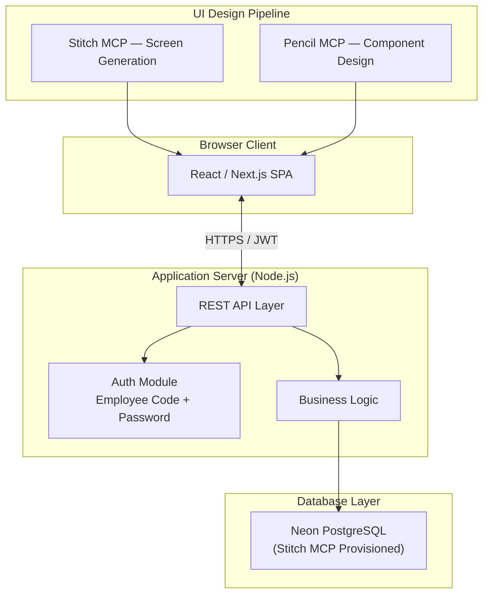
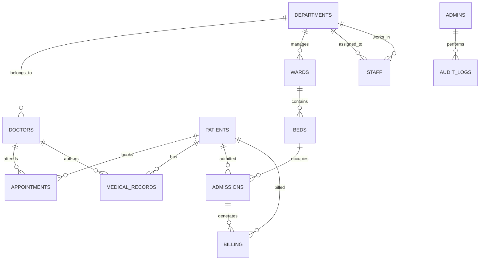
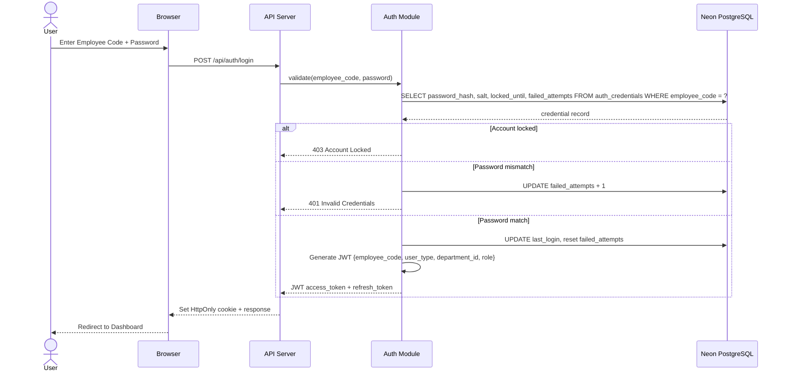
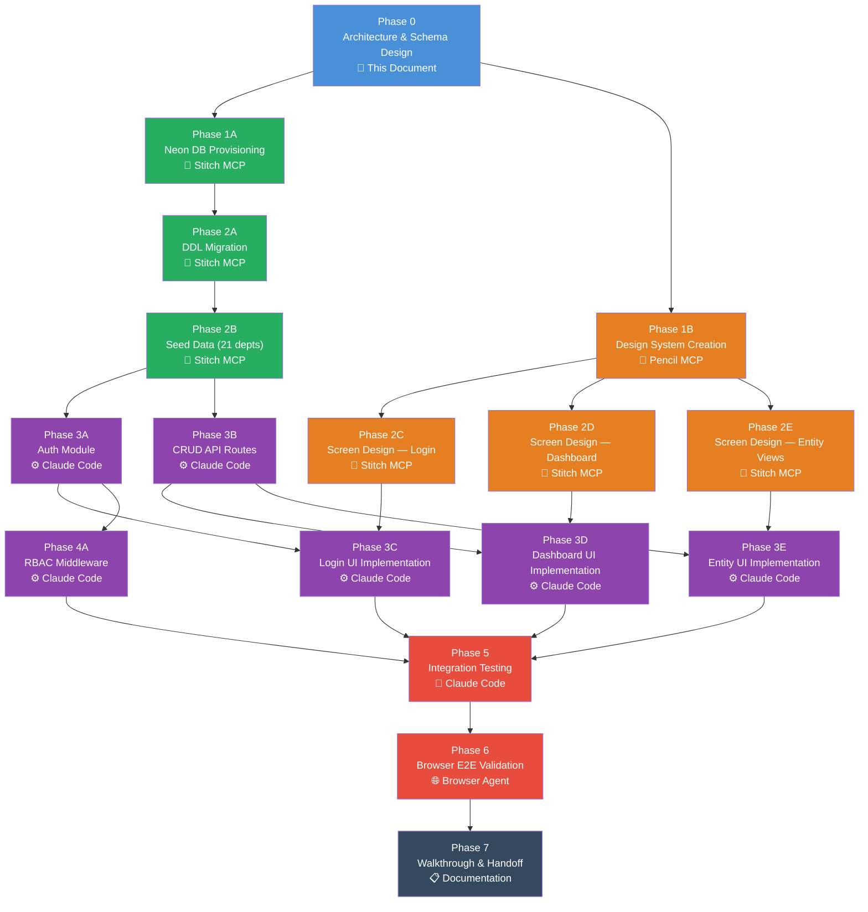

# Hospital Management System — Architectural Plan

A web-hosted, interactive Hospital Management System modeled on an **Indian superspeciality medical institution** with 21 clinical departments, 3NF-normalized PostgreSQL persistence, strict Employee Code authentication, and a multi-tool execution pipeline.

---

## 1. System Architecture Overview



| Layer | Technology | Orchestrator |
|---|---|---|
| **UI Design** | Stitch MCP screens + Pencil MCP components | Stitch & Pencil |
| **Database** | Neon PostgreSQL (cloud) | Stitch MCP / Neon API |
| **Auth** | bcrypt hashing, JWT sessions, RBAC | Claude Code |
| **Application Logic** | Node.js + Express / Next.js API routes | Claude Code |
| **Frontend** | React (generated from Stitch/Pencil exports) | Claude Code |

---

## 2. 3NF Normalized PostgreSQL Schema

> [!IMPORTANT]
> Every table below is in **Third Normal Form**: no partial-key dependencies, no transitive dependencies. Foreign keys enforce referential integrity; composite unique constraints prevent duplicates.

### 2.1 Entity-Relationship Diagram



### 2.2 Table Definitions

#### `departments`
| Column | Type | Constraints |
|---|---|---|
| `id` | `SERIAL` | PK |
| `name` | `VARCHAR(100)` | UNIQUE NOT NULL |
| `code` | `VARCHAR(10)` | UNIQUE NOT NULL |
| `hod_doctor_id` | `INT` | FK → doctors(id), NULLABLE |
| `floor` | `VARCHAR(20)` | |
| `phone_ext` | `VARCHAR(10)` | |
| `is_active` | `BOOLEAN` | DEFAULT TRUE |
| `created_at` | `TIMESTAMPTZ` | DEFAULT NOW() |
| `updated_at` | `TIMESTAMPTZ` | DEFAULT NOW() |

**Seed values (21 departments):**

| Department | Code |
|---|---|
| Cardiology | CARD |
| Neurology | NEUR |
| Oncology | ONCO |
| Orthopedics | ORTH |
| Pediatrics | PEDI |
| Obstetrics & Gynecology | OBGY |
| Gastroenterology | GAST |
| Pulmonology | PULM |
| Nephrology | NEPH |
| Urology | UROL |
| Endocrinology | ENDO |
| Ophthalmology | OPHT |
| ENT | ENTT |
| Dermatology | DERM |
| Psychiatry | PSYC |
| Radiology | RADI |
| Pathology | PATH |
| Anesthesiology | ANES |
| Emergency Medicine | EMER |
| General Surgery | GSUR |
| Internal Medicine | INTM |

---

#### `patients`
| Column | Type | Constraints |
|---|---|---|
| `id` | `SERIAL` | PK |
| `uhid` | `VARCHAR(20)` | UNIQUE NOT NULL — Unique Hospital ID |
| `first_name` | `VARCHAR(100)` | NOT NULL |
| `last_name` | `VARCHAR(100)` | NOT NULL |
| `date_of_birth` | `DATE` | NOT NULL |
| `gender` | `VARCHAR(10)` | CHECK (gender IN ('Male','Female','Other')) |
| `aadhaar_number` | `VARCHAR(12)` | UNIQUE, encrypted |
| `phone` | `VARCHAR(15)` | NOT NULL |
| `email` | `VARCHAR(255)` | |
| `address_line1` | `VARCHAR(255)` | |
| `address_line2` | `VARCHAR(255)` | |
| `city` | `VARCHAR(100)` | |
| `state` | `VARCHAR(100)` | |
| `pincode` | `VARCHAR(6)` | |
| `blood_group` | `VARCHAR(5)` | CHECK (blood_group IN ('A+','A-','B+','B-','AB+','AB-','O+','O-')) |
| `emergency_contact_name` | `VARCHAR(200)` | |
| `emergency_contact_phone` | `VARCHAR(15)` | |
| `is_active` | `BOOLEAN` | DEFAULT TRUE |
| `created_at` | `TIMESTAMPTZ` | DEFAULT NOW() |
| `updated_at` | `TIMESTAMPTZ` | DEFAULT NOW() |

---

#### `doctors`
| Column | Type | Constraints |
|---|---|---|
| `id` | `SERIAL` | PK |
| `employee_code` | `VARCHAR(20)` | UNIQUE NOT NULL |
| `first_name` | `VARCHAR(100)` | NOT NULL |
| `last_name` | `VARCHAR(100)` | NOT NULL |
| `department_id` | `INT` | FK → departments(id) NOT NULL |
| `specialization` | `VARCHAR(200)` | |
| `qualification` | `VARCHAR(300)` | e.g. "MBBS, MD (Cardiology), DM" |
| `medical_council_reg` | `VARCHAR(50)` | MCI/State council registration |
| `phone` | `VARCHAR(15)` | |
| `email` | `VARCHAR(255)` | UNIQUE NOT NULL |
| `consultation_fee` | `DECIMAL(10,2)` | DEFAULT 0.00 |
| `is_active` | `BOOLEAN` | DEFAULT TRUE |
| `joined_date` | `DATE` | |
| `created_at` | `TIMESTAMPTZ` | DEFAULT NOW() |
| `updated_at` | `TIMESTAMPTZ` | DEFAULT NOW() |

---

#### `staff`
| Column | Type | Constraints |
|---|---|---|
| `id` | `SERIAL` | PK |
| `employee_code` | `VARCHAR(20)` | UNIQUE NOT NULL |
| `first_name` | `VARCHAR(100)` | NOT NULL |
| `last_name` | `VARCHAR(100)` | NOT NULL |
| `role` | `VARCHAR(50)` | CHECK (role IN ('Nurse','Technician','Receptionist','Pharmacist','Lab Technician','Ward Boy','Other')) |
| `department_id` | `INT` | FK → departments(id) |
| `phone` | `VARCHAR(15)` | |
| `email` | `VARCHAR(255)` | UNIQUE |
| `shift` | `VARCHAR(20)` | CHECK (shift IN ('Morning','Afternoon','Night','Rotational')) |
| `is_active` | `BOOLEAN` | DEFAULT TRUE |
| `joined_date` | `DATE` | |
| `created_at` | `TIMESTAMPTZ` | DEFAULT NOW() |
| `updated_at` | `TIMESTAMPTZ` | DEFAULT NOW() |

---

#### `admins`
| Column | Type | Constraints |
|---|---|---|
| `id` | `SERIAL` | PK |
| `employee_code` | `VARCHAR(20)` | UNIQUE NOT NULL |
| `first_name` | `VARCHAR(100)` | NOT NULL |
| `last_name` | `VARCHAR(100)` | NOT NULL |
| `email` | `VARCHAR(255)` | UNIQUE NOT NULL |
| `phone` | `VARCHAR(15)` | |
| `access_level` | `VARCHAR(20)` | CHECK (access_level IN ('Super','Hospital','Department')) |
| `department_id` | `INT` | FK → departments(id), NULLABLE |
| `is_active` | `BOOLEAN` | DEFAULT TRUE |
| `created_at` | `TIMESTAMPTZ` | DEFAULT NOW() |
| `updated_at` | `TIMESTAMPTZ` | DEFAULT NOW() |

---

#### `auth_credentials`
| Column | Type | Constraints |
|---|---|---|
| `id` | `SERIAL` | PK |
| `employee_code` | `VARCHAR(20)` | UNIQUE NOT NULL |
| `password_hash` | `VARCHAR(255)` | NOT NULL |
| `salt` | `VARCHAR(64)` | NOT NULL |
| `user_type` | `VARCHAR(20)` | CHECK (user_type IN ('Doctor','Staff','Admin')) NOT NULL |
| `user_ref_id` | `INT` | NOT NULL — polymorphic FK to doctors/staff/admins |
| `last_login` | `TIMESTAMPTZ` | |
| `failed_attempts` | `INT` | DEFAULT 0 |
| `locked_until` | `TIMESTAMPTZ` | |
| `password_changed_at` | `TIMESTAMPTZ` | |
| `must_change_password` | `BOOLEAN` | DEFAULT TRUE |
| `created_at` | `TIMESTAMPTZ` | DEFAULT NOW() |
| `updated_at` | `TIMESTAMPTZ` | DEFAULT NOW() |

---

#### `appointments`
| Column | Type | Constraints |
|---|---|---|
| `id` | `SERIAL` | PK |
| `appointment_no` | `VARCHAR(20)` | UNIQUE NOT NULL |
| `patient_id` | `INT` | FK → patients(id) NOT NULL |
| `doctor_id` | `INT` | FK → doctors(id) NOT NULL |
| `department_id` | `INT` | FK → departments(id) NOT NULL |
| `appointment_date` | `DATE` | NOT NULL |
| `appointment_time` | `TIME` | NOT NULL |
| `duration_minutes` | `INT` | DEFAULT 30 |
| `status` | `VARCHAR(20)` | CHECK (status IN ('Scheduled','Checked-In','In-Progress','Completed','Cancelled','No-Show')) DEFAULT 'Scheduled' |
| `type` | `VARCHAR(30)` | CHECK (type IN ('OPD','Follow-Up','Emergency','Teleconsultation')) |
| `notes` | `TEXT` | |
| `created_by` | `VARCHAR(20)` | FK → auth_credentials(employee_code) |
| `created_at` | `TIMESTAMPTZ` | DEFAULT NOW() |
| `updated_at` | `TIMESTAMPTZ` | DEFAULT NOW() |

**Index:** `(doctor_id, appointment_date)` for schedule queries.

---

#### `medical_records`
| Column | Type | Constraints |
|---|---|---|
| `id` | `SERIAL` | PK |
| `record_no` | `VARCHAR(20)` | UNIQUE NOT NULL |
| `patient_id` | `INT` | FK → patients(id) NOT NULL |
| `doctor_id` | `INT` | FK → doctors(id) NOT NULL |
| `appointment_id` | `INT` | FK → appointments(id) |
| `diagnosis` | `TEXT` | |
| `symptoms` | `TEXT` | |
| `prescription` | `TEXT` | |
| `lab_results` | `JSONB` | |
| `vitals` | `JSONB` | e.g. `{"bp":"120/80","pulse":72,"temp":98.6,"spo2":98}` |
| `follow_up_date` | `DATE` | |
| `notes` | `TEXT` | |
| `created_at` | `TIMESTAMPTZ` | DEFAULT NOW() |
| `updated_at` | `TIMESTAMPTZ` | DEFAULT NOW() |

---

#### `wards`
| Column | Type | Constraints |
|---|---|---|
| `id` | `SERIAL` | PK |
| `name` | `VARCHAR(100)` | NOT NULL |
| `ward_code` | `VARCHAR(10)` | UNIQUE NOT NULL |
| `department_id` | `INT` | FK → departments(id) |
| `ward_type` | `VARCHAR(30)` | CHECK (ward_type IN ('General','Semi-Private','Private','ICU','NICU','PICU','CCU','HDU','Isolation')) |
| `floor` | `VARCHAR(20)` | |
| `total_beds` | `INT` | NOT NULL |
| `charge_per_day` | `DECIMAL(10,2)` | |
| `is_active` | `BOOLEAN` | DEFAULT TRUE |
| `created_at` | `TIMESTAMPTZ` | DEFAULT NOW() |
| `updated_at` | `TIMESTAMPTZ` | DEFAULT NOW() |

---

#### `beds`
| Column | Type | Constraints |
|---|---|---|
| `id` | `SERIAL` | PK |
| `bed_number` | `VARCHAR(10)` | NOT NULL |
| `ward_id` | `INT` | FK → wards(id) NOT NULL |
| `status` | `VARCHAR(20)` | CHECK (status IN ('Available','Occupied','Maintenance','Reserved')) DEFAULT 'Available' |
| `created_at` | `TIMESTAMPTZ` | DEFAULT NOW() |
| `updated_at` | `TIMESTAMPTZ` | DEFAULT NOW() |

**Unique:** `(ward_id, bed_number)`

---

#### `admissions`
| Column | Type | Constraints |
|---|---|---|
| `id` | `SERIAL` | PK |
| `admission_no` | `VARCHAR(20)` | UNIQUE NOT NULL |
| `patient_id` | `INT` | FK → patients(id) NOT NULL |
| `doctor_id` | `INT` | FK → doctors(id) NOT NULL |
| `bed_id` | `INT` | FK → beds(id) NOT NULL |
| `department_id` | `INT` | FK → departments(id) NOT NULL |
| `admission_date` | `TIMESTAMPTZ` | NOT NULL DEFAULT NOW() |
| `discharge_date` | `TIMESTAMPTZ` | |
| `status` | `VARCHAR(20)` | CHECK (status IN ('Active','Discharged','Transferred','LAMA','Expired')) DEFAULT 'Active' |
| `diagnosis_at_admission` | `TEXT` | |
| `discharge_summary` | `TEXT` | |
| `created_at` | `TIMESTAMPTZ` | DEFAULT NOW() |
| `updated_at` | `TIMESTAMPTZ` | DEFAULT NOW() |

---

#### `billing`
| Column | Type | Constraints |
|---|---|---|
| `id` | `SERIAL` | PK |
| `invoice_no` | `VARCHAR(20)` | UNIQUE NOT NULL |
| `patient_id` | `INT` | FK → patients(id) NOT NULL |
| `admission_id` | `INT` | FK → admissions(id), NULLABLE (OPD billing) |
| `total_amount` | `DECIMAL(12,2)` | NOT NULL |
| `discount` | `DECIMAL(12,2)` | DEFAULT 0.00 |
| `tax_amount` | `DECIMAL(12,2)` | DEFAULT 0.00 — GST |
| `net_amount` | `DECIMAL(12,2)` | NOT NULL |
| `payment_status` | `VARCHAR(20)` | CHECK (payment_status IN ('Pending','Partial','Paid','Refunded','Written-Off')) DEFAULT 'Pending' |
| `payment_mode` | `VARCHAR(20)` | CHECK (payment_mode IN ('Cash','Card','UPI','NEFT','Insurance','Mixed')) |
| `insurance_claim_id` | `VARCHAR(50)` | |
| `generated_by` | `VARCHAR(20)` | FK → auth_credentials(employee_code) |
| `created_at` | `TIMESTAMPTZ` | DEFAULT NOW() |
| `updated_at` | `TIMESTAMPTZ` | DEFAULT NOW() |

---

#### `billing_items`
| Column | Type | Constraints |
|---|---|---|
| `id` | `SERIAL` | PK |
| `billing_id` | `INT` | FK → billing(id) NOT NULL |
| `item_type` | `VARCHAR(30)` | CHECK (item_type IN ('Consultation','Procedure','Lab Test','Radiology','Pharmacy','Ward Charge','Surgery','Other')) |
| `description` | `VARCHAR(255)` | NOT NULL |
| `quantity` | `INT` | DEFAULT 1 |
| `unit_price` | `DECIMAL(10,2)` | NOT NULL |
| `total_price` | `DECIMAL(10,2)` | NOT NULL |
| `created_at` | `TIMESTAMPTZ` | DEFAULT NOW() |

---

#### `audit_logs`
| Column | Type | Constraints |
|---|---|---|
| `id` | `BIGSERIAL` | PK |
| `employee_code` | `VARCHAR(20)` | NOT NULL |
| `action` | `VARCHAR(50)` | NOT NULL |
| `entity_type` | `VARCHAR(50)` | |
| `entity_id` | `INT` | |
| `old_values` | `JSONB` | |
| `new_values` | `JSONB` | |
| `ip_address` | `VARCHAR(45)` | |
| `user_agent` | `TEXT` | |
| `created_at` | `TIMESTAMPTZ` | DEFAULT NOW() |

**Index:** `(employee_code, created_at)` for compliance queries.

---

### 2.3 3NF Compliance Verification

| NF Rule | How Satisfied |
|---|---|
| **1NF** | All columns are atomic; no repeating groups. JSONB used only for semi-structured clinical data (vitals, lab_results) which is standard practice. |
| **2NF** | Every non-key column depends on the *entire* primary key (all PKs are single-column surrogates). |
| **3NF** | No transitive dependencies. `billing_items` separated from `billing`; `beds` separated from `wards`; `auth_credentials` separated from user tables. Department info never duplicated in child tables — referenced via FK. |

---

## 3. Authentication Architecture

> [!CAUTION]
> Authentication is strictly **Employee Code + Password** only. No email/username login. No social OAuth.

### 3.1 Employee Code Format

```
EMP-{DEPT_CODE}-{SEQUENCE}
Examples:
  EMP-CARD-00001  →  First cardiologist
  EMP-EMER-00042  →  42nd employee in Emergency Medicine
  EMP-ADMN-00001  →  First admin
```

### 3.2 Authentication Flow



### 3.3 Security Controls

| Control | Implementation |
|---|---|
| **Hashing** | bcrypt (cost factor 12) or argon2id |
| **Rate limiting** | 5 failed attempts → 15-min lockout |
| **JWT** | RS256 signed, 15-min access token, 7-day refresh token |
| **RBAC Roles** | `Super Admin`, `Hospital Admin`, `Department Admin`, `Doctor`, `Nurse`, `Receptionist`, `Staff` |
| **Session** | HttpOnly + Secure + SameSite=Strict cookies |
| **Audit** | Every auth event logged to `audit_logs` |
| **Password policy** | Min 8 chars, 1 uppercase, 1 digit, 1 special char |
| **Force change** | `must_change_password = TRUE` on first login |

### 3.4 RBAC Permission Matrix

| Permission | Super Admin | Hospital Admin | Dept Admin | Doctor | Nurse | Receptionist |
|---|---|---|---|---|---|---|
| Manage Departments | ✅ | ✅ | ❌ | ❌ | ❌ | ❌ |
| Manage Doctors/Staff | ✅ | ✅ | ✅ (own dept) | ❌ | ❌ | ❌ |
| View All Patients | ✅ | ✅ | ✅ | ❌ | ❌ | ✅ |
| Edit Medical Records | ❌ | ❌ | ❌ | ✅ (own) | ❌ | ❌ |
| Create Appointments | ✅ | ✅ | ✅ | ✅ | ✅ | ✅ |
| Manage Wards/Beds | ✅ | ✅ | ✅ | ❌ | ✅ | ❌ |
| Billing Operations | ✅ | ✅ | ❌ | ❌ | ❌ | ✅ |
| View Audit Logs | ✅ | ✅ | ❌ | ❌ | ❌ | ❌ |
| System Settings | ✅ | ❌ | ❌ | ❌ | ❌ | ❌ |

---

## 4. Toolchain Delegation Strategy

### 4.1 Responsibility Matrix

```mermaid
graph LR
    subgraph Stitch["Stitch MCP"]
        S1["Screen Generation"]
        S2["Neon DB Provisioning"]
        S3["DB State Management"]
    end

    subgraph Pencil["Pencil MCP"]
        P1["Component Design System"]
        P2["Design Layouts (.pen files)"]
        P3["Style Guides"]
        P4["Screenshot Validation"]
    end

    subgraph Claude["Claude Code"]
        C1["API Route Synthesis"]
        C2["Auth Module"]
        C3["Business Logic"]
        C4["Frontend Integration"]
        C5["Test Harness"]
    end

    Stitch -->|"Export screens"| Claude
    Pencil -->|"Export components"| Claude
    Claude -->|"Connect to"| Stitch
```



### 4.2 Detailed Delegation

| Concern | Tool | Operations |
|---|---|---|
| **Database provisioning** | Stitch MCP (Neon API) | Create Neon project, execute DDL migrations, seed data, manage connection strings |
| **Screen design** | Stitch MCP | `generate_screen_from_text` for Login, Dashboard, Patient List, Doctor Schedule, Ward Map, Billing, Admin Panel |
| **Component design** | Pencil MCP | Design system: buttons, cards, forms, tables, navigation, modals, badges, status indicators |
| **Design validation** | Pencil MCP | `get_screenshot` to visually verify layouts; `snapshot_layout` to check for overlaps |
| **API layer** | Claude Code | Express/Next.js routes for all CRUD operations, auth endpoints |
| **Auth module** | Claude Code | bcrypt hashing, JWT signing/verification, RBAC middleware, rate limiting |
| **Business logic** | Claude Code | Appointment scheduling, bed management, billing calculations, invoice generation |
| **Frontend** | Claude Code | React components using Stitch/Pencil design tokens, API integration, state management |
| **Testing** | Claude Code | Unit tests (Jest), API integration tests (Supertest), E2E browser tests |

---

## 5. Topological Execution Graph

> [!NOTE]
> The graph below defines the strict dependency order for execution. No phase begins until all its dependencies are complete.



### Execution Order (Critical Path)

```
Phase 0 → Phase 1A ∥ Phase 1B → Phase 2A → Phase 2B ∥ Phase 2C–2E
          → Phase 3A ∥ Phase 3B ∥ Phase 3C–3E → Phase 4A
          → Phase 5 → Phase 6 → Phase 7
```

**Legend:** `→` = sequential dependency, `∥` = parallelizable

---

## 6. Project Directory Structure

```
a:\Hospital Management System\
├── docs/
│   ├── architecture.md           ← This document
│   ├── er-diagram.md
│   └── api-spec.md
├── database/
│   ├── migrations/
│   │   ├── 001_create_departments.sql
│   │   ├── 002_create_patients.sql
│   │   ├── 003_create_doctors.sql
│   │   ├── 004_create_staff.sql
│   │   ├── 005_create_admins.sql
│   │   ├── 006_create_auth_credentials.sql
│   │   ├── 007_create_appointments.sql
│   │   ├── 008_create_medical_records.sql
│   │   ├── 009_create_wards.sql
│   │   ├── 010_create_beds.sql
│   │   ├── 011_create_admissions.sql
│   │   ├── 012_create_billing.sql
│   │   ├── 013_create_billing_items.sql
│   │   ├── 014_create_audit_logs.sql
│   │   └── 015_seed_departments.sql
│   └── seed/
│       └── departments.sql
├── server/
│   ├── src/
│   │   ├── config/
│   │   ├── middleware/
│   │   │   ├── auth.js
│   │   │   ├── rbac.js
│   │   │   └── rateLimiter.js
│   │   ├── routes/
│   │   │   ├── auth.routes.js
│   │   │   ├── patients.routes.js
│   │   │   ├── doctors.routes.js
│   │   │   ├── appointments.routes.js
│   │   │   ├── wards.routes.js
│   │   │   ├── billing.routes.js
│   │   │   └── admin.routes.js
│   │   ├── controllers/
│   │   ├── services/
│   │   ├── models/
│   │   └── utils/
│   ├── package.json
│   └── server.js
├── client/
│   ├── src/
│   │   ├── components/
│   │   ├── pages/
│   │   ├── hooks/
│   │   ├── services/
│   │   └── styles/
│   └── package.json
├── designs/
│   ├── system.pen                ← Pencil design system
│   └── screens/                  ← Stitch-generated screens
└── tests/
    ├── unit/
    ├── integration/
    └── e2e/
```

---

## 7. Proposed Changes Summary

### Database Layer
- **[NEW]** `database/migrations/001–015` — 14 DDL files + 1 seed file
- **[NEW]** `database/seed/departments.sql` — 21 department records

### Server
- **[NEW]** `server/` — Express.js application with modular route structure
- **[NEW]** `server/src/middleware/auth.js` — JWT verification + Employee Code validation
- **[NEW]** `server/src/middleware/rbac.js` — Role-based access control guard
- **[NEW]** `server/src/routes/*.routes.js` — CRUD endpoints for all entities

### Client
- **[NEW]** `client/` — React SPA bootstrapped from Stitch/Pencil exports

### Design
- **[NEW]** `designs/system.pen` — Pencil design system
- **[NEW]** Stitch screens for Login, Dashboard, and all entity views

---

## Verification Plan

### Automated Tests
1. **Schema validation**: Run all 15 migration files against a Neon test database; verify tables, constraints, and indexes via `\dt`, `\d+ table_name`.
2. **Auth unit tests**: `npx jest tests/unit/auth.test.js` — test password hashing, JWT generation, Employee Code validation, lockout after 5 failures.
3. **API integration tests**: `npx jest tests/integration/` — test all CRUD endpoints with authenticated and unauthenticated requests.
4. **3NF audit**: Manual review of schema DDL to confirm no partial-key or transitive dependencies.

### Manual Verification
1. **Browser walkthrough**: Navigate Login → Dashboard → Patient Registration → Appointment Booking → Billing flow end-to-end.
2. **RBAC test**: Log in as Doctor and confirm inability to access Admin routes; log in as Admin and confirm full access.
3. **Design review**: Use `mcp_pencil_get_screenshot` to take screenshots of all designed screens and verify visual correctness.
